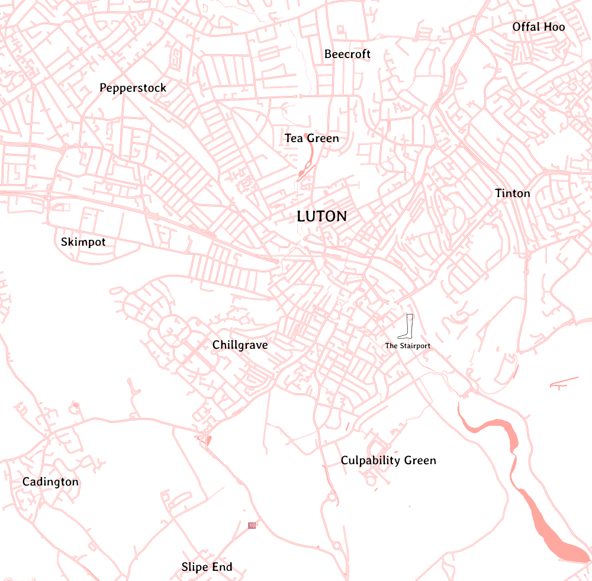
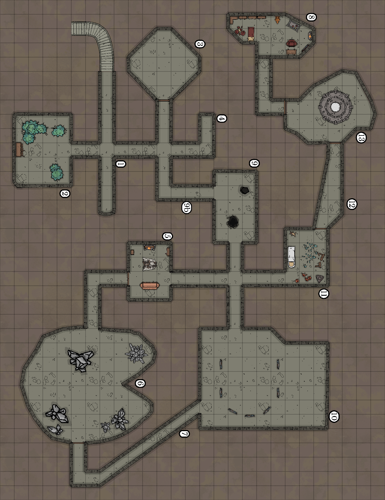

An adventure for Troika!, set in the fantastical town of Luton, wherein a wizard accidentally transmutes the (St)airport into a dungeon of crystalline chaos.

> Some parts of this adventure are marked as bold blocks. These are addressed directly to the PCs and can be read out verbatim without giving away any secrets.

Other parts, you can paraphrase or ignore as you see fit.

## Introduction

The Stairport recently hired a wizard to refurbish their Arrivals lounge. He was from elsewhere, but had a great CV. He told them his name was "Strobo the Strangely Effective"; in fact, it is really just "Strobo the Strange", and he is not as professional as he seems.

His hasty, unplanned refurbishment went over-time and over-budget. In a panic, Strobo tried to take a shortcut, using ill-advised dark magic to speed things up. Unfortunately, this resulted in an incursion from a chaos sphere into this one, 20 minutes before the PCs arrived at the Stairport. Now, the only way to get into Luton is through the dungeon which sits between Customs and the Foyer (unless you're prepared to wait for someone else to sort it out). Strobo is himself stranded in the dungeon, along with several transformed members of the Stairport staff who are making it difficult for him to leave.

Communications in and out of the Stairport are being disrupted by the chaos incursion, making it near impossible to warn incoming vessels of the danger. Consequently, the Stairport is full of stranded travellers from all over the spheres, either trying to leave Luton or get into it. While magic works in Arrivals and in the dungeon, all attempts at teleporting or portalling in have failed so far.

## Landing at the Stairport

> The Stairport is the gateway to Luton. A staircase of gargantuan proportions, leading nowhere. Drawers open in its sides to welcome incoming vessels.

> On the top of the Stairport is an enormous detached foot and ankle. Where the leg has been truncated, a pool of what looks like blood ripples atop the stump, brimming over onto the toes then cascading down the stairs. It is believed that the foot was severed from The Dead God during a revolt, millenia ago. It bleeds ceaselessly.

> The current ruler of Luton is Giant Child, the only son of this Dead God.

> Far below you see the sprawling melting pot that is Luton. To the east, the smoke-belching towers of industrial Tinton; to the south, the dank, treacherous labyrinth of Cadington; in the centre, that vast cemetery, Chillgrave; to the west, affluent idlers' paradise and tourist destination, Skimpot; and finally, in the north, the hive-shaped follies of aristocratic Beecroft.

> As you approach, a 50' wide drawer slides open half-way up the side of the Stairport, accompanied by an ear-splitting shriek of wood on wood. It comes to a stop and a faceless creature resembling a pile of dirty rags on stilts climbs up from inside to stand on the edge of the drawer. The being frantically beckons to your pilot, Drago, with a tattered yellow flag. Drago tilts the golden barge towards the open drawer.

> Once the barge settles into the drawer, the wooden surface beneath you rumbles as it closes, plunging you into darkness. Moments later, lanterns on the wall flicker to life. You are in a pale, buttery, wooden twilight. The drawer is empty except for your golden barge, the dishevelled creature who directed your landing, and an elaborate cake about the size of a bungalow. It smells strongly of vanilla and bleach. At the far end of the drawer is a tiny door with a sign above which reads "Arrivals". It seems barely large enough to admit you, let alone the cake. The creature who guided you in is leaning against a nearby wall in shadow, clicking. There is a sign hanging on the wall next to it which says "Willkommen bei Luton!"; below it is a map.

### The cake

The cake has been ordered for Giant Child's birthday from a foreign dignitary. Any attempt to touch or eat it will result in severe sanctions, as it is tantamount to treason. No guards are posted on it as it's assumed no one would dare offend Giant Child.

It tastes of vanilla and bleach, as you'd expect from the smell. Parts of it look a bit mouldy. The icing spells out the initials "GC". The decoration depicts what looks like a massive baby, wearing a nappy, tearing apart a variety of manticores, giant snakes, goblins and minotaurs. (Giant Child was responsible for destroying the remaining goblins in this sphere, resulting in their replacement by the OObla - a genetically/magically engineered race of goblin stand-ins who aren't quite goblins, though they do try very hard.)

It is apparent the decoration tells a story: further on, the baby sits down and has a picnic with similarly massive humans, surrounded by a mass of tiny humans. Some of the tiny humans are being picked up and eaten. The baby is grinning.

In the final panel, the baby is seen standing on the chest of a gigantic, dead man with one foot missing, brandishing a golden machete covered in blood, punching the air with its other fist and screaming.

### The marshal

The creature who directed the landing does not speak; it just breathes in a slow, raspy, sinister way, leaning in close. If flustered or held up, it will frantically gesture at the exit with its flag, held in a bony, sinewy claw. On close inspection, one may discern 6 legs, most of which are kept tucked in its rags, which unfold ominously if you wait around long enough. Its face is bound in bandages; a single black eye will peer out from different folds.

### The map

The map on the wall shows Luton and its environs.

A brief overview of areas of Luton, in case anyone asks:

* Beecroft (bees, bees, bees; bees == status; middle class)
* Skimpot (cookery, tourists, idlers)
* Offal Hoo (lower middle class suburbs)
* Tea Green (capital for tea, just tea shops, intrigue between them, industrial espionage)
* Tinton (machine shops, industry, steampunk; few lower class houses in abandoned factories round edges)
* Chillgrave (undead, walled off, separate micro-state within Luton ruled by lord of the undead, Lord Fonzie)
* Pepperstock (guns, underworld, lower class)
* Cadington (rogues, lower class)
* Slipe End (underbelly, lower class)
* Culpability Green (judgemental, upper class, noble professions like lawyers and judges)

## Attempting to leave the Stairport

Any vessel attempting to leave is treated as a biohazard and won't be allowed to go. The marshal who helped the PCs' barge land is actually capable of holding vessels in the air and bringing them back into the Stairport through sheer force of will. This power can only affect travellers: it is not capable of holding arbitrary physical objects in place, only sentient beings with an intention to travel and their vessels. It is therefore of limited use anywhere except an airport.

## Arrivals lounge

> The door opens out into a large, low-ceilinged chamber, about the size of a football pitch. The walls are plain white, but heavily cracked; the ceiling is much lower than it is supposed to be, fractured and sagging towards the floor; wooden struts, piles of books, piles of bricks and other makeshift pillars appear to be holding parts of it up. There is a gentle groaning and creaking emanating from all surfaces as they, almost imperceptibly, shift. The air is thick with scents: pine, sweat, alcohol, musty fungus, decay, chlorine. The floor is pocked with green, seething puddles.

> A multitude of tired humans and other creatures are crammed onto every seat and sprawling over the floor (avoiding the puddles), shifting awkwardly and only just not killing each other. There is a low murmur of conversation but the atmosphere is tense and oppressive.

> In the centre of the room are two desks facing each other, one with a sign saying "Immigration", the other "Emigration". Identical women are seated behind each desk. Between them is a white pedastal with a glass box on top.

> Along the west wall are 6 carpet shops. Built into the east wall is a row of wormeries. To the north, in ominous greenish fog, you can make out a large pile of furniture; beyond that are three 10' tall gateways.

The door of each drawer/hanger leads into this area. The way out is through the Customs gates (see below).

### Entities in Arrivals

This is a selection of the interesting people who may be encountered in Arrivals:

* **A pale, wiry woman** in torn, bloodied armour, exhausted next to a large battleaxe. Her face is draped with linen and barely visible through it (a religious obeyance). She is called **Roach**. She talks in a medieval, epic sort of way, like a hero, but a bit too full of herself. She came from the Foyer through the dungeon and is waiting to leave, but is being held by the quarantine. She'll try to persuade the PCs to wait for the cavalry and not go in themselves. But if they insist they want to venture forth, she will reveal two things about the dungeon:
  1. "There is a corridor which claims to be full of traps. It's all mouth and no trousers. There are two covered pits, nothing more."
  2. "Don't open the door which says 'Lost Property'. Just don't. I don't want to talk about it."
  She adds: "Though it could all be different now. It was changing around me as I was moving through it."
* **Members of an undead commune**, in dusty robes, twitching and shuddering slightly, licking their lips with slobber dripping down their clothes. "We are in thrall to Lord Ponzi, our undead master." They speak in deep sonorous voices, in unison. "We have no interest in what you offer. We already have all. Would you care to join us?" They are trying to regenerate after a hard few days of slaying and don't want to be disturbed. They will attack if sufficiently disturbed. They are making everyone else in Arrivals very nervous.
* **A family of origami dragons** with a tiresome son, Bonaparte, who has a sweet tooth and will badger passersby for food. The mum anxiously tells family members to stay away from the lanterns.
* **A very hairy, shifty-looking orc**. He is **Harty Jarrold** and he smells of beer. He claims his mum's dog has been replaced by a man wearing a dog costume. He is correct, but has the motives wrong: the dog man is not trying to steal the family fortune (there isn't one), but is working for the Preventive Bureau, spying on Harty, who has said seditious things about Giant Child.
* **A man in dark glasses**, wearing a very sharp, light grey suit and bow tie, carrying a (normal) screwdriver. He is **Michael Who? (No Relation)**, a man who talks endlessly about time travel. "I've seen attack ships off the arm of Orion. I've been to this dump...what was it called?...Rome. I met this hairy dude there who did some weird magic shit with bread and fish. I met someone called Vince who was cruelly left for dead and dumped in a hole on an obscure moon." (He patently has never done anything he claims. Or has he?)
* A group of **drunken and bellicose centaurs**, ducking under the low ceiling ("This roof is too low, sport!"), spoiling for a fight. They will invite anyone who comes within earshot to drink with them, and won't take "no" for an answer. They are drinking very strong, unusual spirits which may well be hallucinogens or poisons. They will continuously interrupt anyone who's talking to brag about their achievements. Things will inevitably end in combat.
* **Three badgers wearing green waistcoats**, in a gilded cage. They appear to be speaking to each other in a private language. They have been captured and enslaved, though their master has disappeared. They can speak halting Common tongue and politely ask to be let out in very quiet voices. However, if they are released, they become absolute maniacs and will start attacking people, starting with children.

### Emigration/Immigration desks

Two desks face each other, with signs "Immigration" and "Emigration" above. Between the two desks is a pedastal, on top of which is a glass box the size of a breadbin, with the sign "A migration" (see later).

Identical women sit at each desk. They appear to be twins. Both have elaborate bee-hive hairstyles, large butterfly-shaped glasses, heavy eye make-up and lipstick and name badges; **Nora's** (immigration) is deep red, **Lazzaza's** (emigration) is green. They are wearing the (blue with gold piping) uniforms of the Preventive Bureau (one prevents people coming in, the other prevents them going out). They talk bureaucratic nonsense in sing-song voices, but edged with tension and fear. They still prefix each sentence with "Bing bong!". Despite the situation, they still insist on long and complicated forms being filled out before anyone is allowed to leave Arrivals.

Two paper planes sail across the room, right into the hands of the two women. After unfolding and reading the notes, they then simultaneously announce over their magical public address system:

"Bing bong! Owing to unforeseen circumstances, a mad wizard engaged to refurbish the Arrivals lounge has allowed a viral subdimension to intrude upon our sphere. As a result, all visitors are currently required to exit the Stairport via what we presume is his lair. Safety announcement: Survivors have reported that the lair is infested with chaotic crystal entities. We are currently unable to issue outgoing exit visas to depart Luton, as we are required by common decency and the word of our ruler, Giant Child, to prevent transmission of the crystal entities elsewhere. In the meantime, you may either leave through the lair - located there" (points at the Customs gates) - "or bear with us while we work tirelessly to resolve this difficult situation."

These women and two guards (see Customs gates, below) are the only remaining representatives of the Preventive Bureau in the Stairport. Other staff have disappeared, been transformed, or melted into puddles of acid. If asked, the women will explain the situation as they understand it:

* The dungeon appeared 20 minutes ago.
* The staff melted/disappeared/turned into worms/carpet salespeople etc.
* A band of 4 adventurers entered the dungeon 10 minutes ago. They haven't seen any more of them, so maybe they got through?
* The woman called Roach is the only person who's made it through from the Foyer to Arrivals so far, but she isn't allowed to leave.
* The paper planes they just received are the first contact they've had with the authorities since the crisis started.
* The wormeries and the carpet shops are not the usual facilities, they also appeared 20 minutes ago, replacing the gorgeous department stores and duty free.
* The salespeople in the carpet shops are mere simulacra of Nora and Lazzaza, and not real members of the Preventive Bureau.
* If pressed, they will reveal the other part of the message, which they didn't read out: No wizards are able to teleport in or open a portal into Arrivals, as it is surrounded by an anti-magic field.

The women are taking all this remarkably well, being consummate professionals.

### The living sculpture, "A migration"

The glass box on the pedastal contains a living sculpture: a microcosmic world of two grassy "continents" separated by a shallow pool of red liquid. Tiny, black, scrawny bird-like creatures sprout from the earth on the first continent, slowly flap to the second continent, settle and start to eat the thready grass. Suddenly, they are ambushed by white maggot-like creatures with human-like faces which crawl from the ground. The maggots dissect the dead "birds", attaching their wings onto their own worm-like bodies. They then fly back over the pool to the first continent. On reaching it, the wings take on a life of their own, flapping in opposing directions to tear the maggots apart. The fleshy chunks dissolve into the ground, giving rise to the next generation of black bird-like creatures, and the cycle repeats, ad infinitum.

On the sign, under the title "A migration", in smaller letters, it says "You're better off staying where you are". Below that: "Brought to you by Heffle Prig, by command of the Preventive Bureau".

### Carpet shops

Each carpet shop is called, simply, "Carpet shop", and sells a range of heavy, mostly green, slightly damp carpets. The interiors smell of damp washing and cardboard. The salespeople are all identical to the women on the immigration/emigration desk, but dressed in green ponchos apparently made of carpet and with grey hair and lipstick. They also have uncannily-textured skin, which resembles peeling wallpaper. They are not able to speak, constrained to mere groans.

Inside each carpet shop, on a sturdy mahogany table, is a "Carpet shop shop" (not for sale): a scale model of the carpet shop which it sits inside. Inside mode that is table on which stands an even smaller "Carpet shop shop shop"; and inside that, a minute "Carpet shop shop shop shop". Beyond that, though, things are getting too small to see without a magnifying glass.

### Wormeries

These have 6x6' glass panels at the front. They are packed with dark earth, threaded with tiny worm channels. Average, everyday worms are busy eating their way through the earth. Compost is heaped on top; a single buttercup grows inside one of the cases. Close up, though, sibilant voices can be heard through the glass: "We know you. We've seen you before. Have you found a way out yet?"

### Customs gates

The stranded passengers are clustered at one end of Arrivals. At the other end, a temporary barricade has been fashioned from assorted furniture. Most people are keeping clear of the area.

Beyond the barricade, there is an ominous green mist, surrounding three gates which should lead to the foyer, but which now lead into the Crystal Dungeon of Strobo the Strange. Once pristine white, they are now cracked and dirty, sprouting spiky green-tinged crystal, dripping acid into pools around their bases. The original two gates, "Nothing to declare" and "Something to declare", have been joined by a third: "Nothing to declare but my genius (Oscar Wilde only)". Railway tracks lead from the barricade into each gate.

Two Customs officers, also members of the Preventive Bureau, are hiding behind an overturned table a few metres from the gates. They are warily watching in case anything emerges to threaten the people in Arrivals. Their hope is that more Preventive Officers will arrive to help, or that Strobo will dispel the dungeon, before anyone gets killed.

**Metrophian**, a woman and the larger of the two, has the rank "Associate Preventive Officer". She is about 50% clockwork, and whirrs and buzzes as she moves. Her arm is massively out of scale with her body; it ends with a rapidly-rotating saw blade. She is determined to "prevent bad things from happening". She is fond of winking, is fatalistic, and almost seems to want a fight in which she can die gloriously (think, deranged viking). She recognises the greenish crystals sprouting from the Customs gates as signs of chaos.

The other, **Bruno Jupiter**, is a "Junior Preventive Officer". He is more concerned with "preventing himself being killed". He is cowardly, snivelling, looking for excuses to leave, and points out their shift has ended.

* "Shouldn't we just wait this out? We could barricade ourselves in?"
* "Those adventurers went in. But they won't come out. We're all going to die!"
* "It's terrorists, I tell you! There'll be a ransom demand soon. Or they'll just kill us...for fun!"
* "And what about the undead over there? We can't hang around too long. They'll get hungry. We need to do something about them."

#### Leaving Arrivals through Customs

The hope is that the PCs will make the decision to enter the dungeon of their own volition. If they don't, drastic action may be required.

Inside the wormeries, the worms begin to swell, filling the cases with worm flesh. Eventually, the outward pressure cracks the glass, and enormous, hideous worms slop into the Arrivals lounge. The worms now appear more like maggots, but with circular mouths ringed with teeth, like lamprey mouths.

At the same time, the limbs of the carpet salespeople lengthen, creaking like rusty hinges. Their faces distend, mouths widening, revealing rows of splintered, black teeth. Their groaning intensifies as they move towards their prey.

Make it clear the PCs shouldn't hang around. If they do, perhaps in some vain attempt at saving people, there are **6 carpet salespeople** (Skill 7, Stamina 14, Init 2, Armour 0, Damage as modest beast) and **10 chaos worms** (Skill 7, Stamina 21, Init 1, Armour 1, Damage as large beast, Special: On a successful attack, the victim is swallowed unless they test their luck, taking 4 acid damage each turn they're inside the worm; armour protects against this damage for one turn, but is then dissolved; the worm must be killed to get the victim out). The **8 living dead** will also take the opportunity to feast (Skill 6, Stamina 12, Init 1, Armour 0, Damage as modest beast). If they've been let out, the **3 badgers** will also attack (Skill 5, Stamina 10, Init 2, Armour 0, Damage as small beast).

If hell breaks loose, some of the (not undead) entities mentioned above will make a run for the Customs gates. However, due to the chaotic nature of the gates, each group entering will end up in a slightly different version of the dungeon (though many of the features are shared). So when the PCs enter the gates (hopefully together), they will be "alone" in *their* instance of the dungeon.

## The Dungeon of Crystal Doom

On entering the gate, the PCs feel a shift in reality, and are suddenly at the top of a spiral staircase, inside a dim, cube-shaped stone room with no other exits. There is a faint sound of dripping coming from down the stairs, and a faint shuffling noise. It is eerily quiet apart from that. The staircase is treacherous, the stone crumbling, rotten and coated with slime (the careless must roll Skill+4 or take a tumble + 2 damage). A pool of acid is in one (2 points of damage to anyone who touches it).

### General features

The dungeon varies wildly in style and decrepitude. The initial corridor is pristine blocks of marble, dimly lit, reminding you of a prison shower block (minus the showers). The floor is mostly clean, except for a trail of green crystals, leading to a shadowy, stooped figure.

Other corridors vary in texture and materials: from red brick corridors with gaudily-tiled floors, through rough-hewn natural stone passageways, to wood-panelled hallways. Sudden puddles of acid make the footing treacherous. Random rivulets of viscous rainbow fluid seep from occasional cracks.

### 1. Entrance Hall (Muggins, the janitor)

A grey, winged, 7' tall demon janitor, stooping in overalls. He is called **Muggins**, has a Yorkshire accent, deep frown, and tiny cut-off horns. When he moves, he is supernaturally fast. He is the mildly-transformed caretaker of the Stairport.

He is sweeping sparkling green crystals with a broom into a drain at the end of the corridor.

He complains about the amount of work he has to do: "The heart just keeps growing new bits...more for Muggins here to do...look, there's another bloody patch of the stuff."

All he knows is that he's a janitor and there are crystal entities in the dungeon, leaving trails behind them, which he is compelled to clear up. He can't remember why as his memory has been wiped by his transformation.

A sign points south to "Veterinary and Plant Control", where there is a deep red glow at the end of a red brick passageway. Another larger one points north along a dingy stone corridor to "Baggage Claim", "Bathrooms", "Check Out Desk", "Concourse", "Exit to Luton", "Hotels", "Strange Laboratory", "Lost Property", "Passenger Lounge", and "Mysterious Globe".

### 2. Veterinary and Plant Control (blood blooms)

> The room is damp, and gloomy, suffused with a sourceless scarlet light. Thick yellow roots press up through the cracks. The wallpaper is decorated with large red roses. Lodged into the corners and walls are blood red flowers the size of cartwheels. While oppressively humid, the air smells pleasantly of baked bread.

> At the back of the room between two of the flowers are a pair of chests.

> The flowers seem to be moving slightly...in your direction. Razor-sharp tendrils flick out from between their leaves as they advance.

<h4>Blood Blooms</h4>
<ul>
<li>Skill: 6</li>
<li>Stamina: 9</li>
<li>Init: 1</li>
<li>Armour: 0</li>
<li>Damage as small beast (tendril)</li>
<li>Special: Soporific cloud - test luck or inhale gas and take -2 to Skill next turn; can use at the same time as attacking with tendril, once per battle</li>
</ul>

The flowers are slow and won't leave the room, so can be escaped fairly easily.

The drawers contain 20 silver pennies and 1 healing potion (2d6 STA).

### 3. Lost Property (giant zombie hamster)

The metal sign on the heavy oak door is hanging askew; "Last Property" is scrawled on it in charcoal.

Inside is pitch black and smells like a rodent's cage. Vast black droppings are dotted over the floor. You can hear faint scratching.

There are no other exits and the room contains nothing of value.

A giant flesh-less rodent skulls thrusts out of the darkness, fangs gnashing! It is attached to a fleshy giant hamster body.

<h4>Giant Zombie Hamster</h4>
<ul>
<li>Skill: 7</li>
<li>Stamina: 18</li>
<li>Init: 2</li>
<li>Armour: 0</li>
<li>Damage as large beast</li>
</ul>

### 4. Mysterious Globe

On a squat plinth sits a globe. A sign on the plinth says:

"Whoooah whoooah woooah! Mysterious Globe! It brings the truth close to you."

The globe is milky white and featureless at first. But as you watch, the face of &lt;the GM running this game&gt; appears. (Describe yourself as accurately as possible.)

The face says: "You can ask me one question about the dungeon, which I will answer truthfully."

The GM must answer one question from each character, as truthfully as they see fit. (I will usually tell the absolute truth.)

### 5. Passenger Lounge (kitten sphinx)

> A cosy, warm, wood-panelled room with a scent of jasmine. There is a fireplace on the west wall, with a white spray of flowers in a jug on the mantle above; a rug embroidered with roses on the floor in front of the fire; and a side table next to a leather armchair against the east wall. On the table is a glass of brown liquid (whisky). A chest sits behind the armchair. There are exits to the north and south.

> Lying on the rug is a kitten. At least, it looks like a kitten at first. But as you enter the room, it turns its head towards you, and you see it has the face of a young girl aged about 8, but with green, cat-like eyes.

The kitten sphinx speaks with a little girl voice and manner. She insists that the PCs must answer her riddles to be allowed to pass: "I do know riddles! I do! You won't get this one, it's really good!"

However, she is still learning, so the riddles aren't very good or very difficult; they are mostly made tricky by the fact she gets them wrong. "I'll get better ones as I get bigger, that's what mum said."

* Q: "Which thingamujig walks on four legs for breakfast, two legs at lunch time, and three at bed time. Or is it four again?" A: A human being.
* Q: "I'm tall when little and short when grown up. What am I?" A: A candle.
* Q: "What has a face and hands but not leggies?" A: A clock.
* Q: "What gets wetter as it gets drier?" A: A towel.
* Q: "What has an eye but you can't see it?" A: A needle.
* Q: "What weighs more: a pound of feathers or a two pound of bricks?" A: Two pounds of bricks.

She will get more and more cross if her riddles are successively answered. She will start crying when she runs out of riddles, saying how she's "Not a good sphinx". At this point, she will let the PCs pass through her room without conflict, feeling sorry for herself.

If the PCs get any riddles wrong, or pretend to, she'll give them multiple chances to try again. Generally she is good-natured, and providing they get some right and are nice to her, she'll let them through.

If asked, she will claim that she has always lived here, and that her mum will be back soon. There is no explanation for why there is whisky on the table. She seems unaware that she is in the middle of a dungeon.

<h4>Lottie, the Kitten Sphinx</h4>
<ul>
<li>Skill: 8</li>
<li>Stamina: 15</li>
<li>Init: 3</li>
<li>Armour: 0</li>
<li>Damage as small beast</li>
</ul>

The chest is trapped, and will shoot spikes into anyone opening it unless disarmed first, damage as knife. It contains a rune stone embossed with a picture of a cowboy, some worthless baubles/marbles, and 10 silver pennies. These are the kitten sphinx's few possessions, which she would like to keep hold of.

### 6. Concourse (crystal heart)

> A pale green glow emanates from the doorway, washing into the corridor.

> Inside, black lightning streaks of energy jolt through the air, leaving behind a static charge which makes your hair stand on end. There is a harsh smell of ozone. The room is about 40' wide and long. Its walls are covered with a layer of green, glowing crystal beetles in constant movement. The floor is warm and you can feel a faint heartbeat coming from it through your feet. Though it looks like stone, it feels like skin. Trails of green crystals criss-cross the area.

> A shaft of daylight comes through a hole in the roof, refracting and glinting from emerald stalagmites and stalactites. You see a vague movement behind one of the larger stalgmites. A skittering sound echoes briefly then stops.

This is the home of the **Crystal Heart**, a chaotic beast which spawns new pieces of dungeon around it as it moves, leaving behind trails of green crystal. Killing the heart will cause the dungeon to collapse in on itself, and the rooms and trapped airport staff and visitors revert to their original state. If the heart leaves the dungeon, it will deteriorate, the rooms and even the creatures within shattering into hundreds of pieces.

<h4>The Crystal Heart</h4>
<ul>
<li>Skill: 8</li>
<li>Stamina: 30 (will flee at 15 STA)</li>
<li>Init: 3</li>
<li>Armour: 2</li>
<li>Damage as moderate beast</li>
<li>Special: On a hit on the creature, crystal shards spray from the wound, embedding in your flesh and injecting acid. Take 1 damage each turn until you successfully test luck or your luck reaches 0.</li>
<li>Special: Flee - when the beast reaches 15 STA, it will attempt to retreat, using its next action to generate a passageway out of the dungeon and fleeing into the main Stairport concourse.</li>
</ul>

### 7. Service Corridor (disco ooze)

> The walls are covered with cracked, grey plaster. A greenish grey ooze weeps from the cracks. There is a faint chemical smell and a soft sucking, slurping noise.

> A beat starts, softly at first, gradually growing louder, at around 120bpm: dum dum dum dum DUM DUM DUM DUM! Gradually, it becomes deafening.

As it reaches its crescendo, a shape coalesces from the ooze, moving in time to the beat. It is "throwing shapes" in time with the beat. It flings out slimy pseudopods at intruders, still in time with the beat.

<h4>Disco Ooze</h4>
<ul>
<li>Skill: 7</li>
<li>Stamina: 12</li>
<li>Init: 3</li>
<li>Armour: 1</li>
<li>Damage as small beast</li>
</ul>

### 8. Laboratory of Strobo the Strange

Strobo is a wizard whose lab has been teleported temporarily into the dungeon, due to him over-reaching himself and causing chaos to enter this sphere.

He will emerge into area 13 when the PCs arrive there.

Strobo is a green slime being wrapped in fine metal armour. Only his slimy, shiny head and hands are visible. He is wearing goggles, though you can't see his eyes. He talks in a bubbling, slurpy kind of way.

"Oh! I didn't expect visitors. Thank goodness you're here! Are you the rescue party? I wasn't sure how long I'd be stuck in here. My own fault really, I suppose. Hubris! Who are you fine young fellows? I'm Strobo. Some call me Strobo the Strange. I won't shake hands." (they are dripping slime)

Strobo has been doing experiments with time and space, in an attempt to make his refurbishment of the Stairport more engaging. He is trying to find a cure for his slimy condition, which is a curse.

His lab has two bookshelves, desk, bed, and masses of lab equipment. Everything is pristine, except for puddles and trails of slime.

Books on the shelves include:

* "Tropical Diseases and How to Bottle Them" by Vivian Pale of the Blistered Hand
* "Loud Noises I Have Made and the Unfortunates Who Heard Them" by Jantelorn Earbane
* "McMavek's Forbidden Travels in the West" by Ginty McMavek the Unpleasant
* "The Uses of Hair" by Philbert Dabble
* "Alchemy for Children" by Goody Twosocks
* "Hideous Blights of Ancient Times" by Janzar
* "Muddling with Puddles: The Vague Science of Oozes and Puddings" by Vivian Pale of the Blistered Hand

### 9b. Spooky Corridor

This corridor is roughly hewn from stone. You can hear creaking wood to the north (coffins breaking open).

### 9. Check Out Desk (skeletons)

A broken desk lies in the middle of the floor, between two holes filled with smashed wooden planks. Two skeletons, encrusted with green crystals and wearing gas masks, climb out of the holes. "We hope you enjoyed your flight," they hiss: "Time...to...disembark!" Each has a steel pen and a clipboard (which they use to attack), and a degraded blue and gold tabard (which acts as armour).

<h4>2 Skeleton Flight Attendants</h4>
<ul>
<li>Skill: 6</li>
<li>Stamina: 10</li>
<li>Init: 1</li>
<li>Armour: 1</li>
<li>Damage as moderate beast (steel pen and clipboard)</li>
</ul>

In one of the coffins is a long service medal, engraved with "Giant Child's best flight attendant award for last year", with 5 snake-like spikes coming out of it (can be used as a knife), worth 50 silver pennies.

### 10. Bathroom

The door to this room has a frosted glass pane. There is a unisex+unispecies toilet symbol in the centre of it.

The bathroom has turned into a hall of mirrors, around 40' square. 7 mirrors are arranged in a semi-circle, facing you as you enter the room. It is extremely cold; a layer of frost speckles each mirror. The lighting is too bright and particularly unflattering. The floor is elaborately carved with an abstract flower motif.

If a PC sees their reflection in a mirror, a copy of them emerges and performs an attack. Smashing a mirror prevents this from happening. It also banishes any copy which has emerged. The copies will protect their origin mirrors zealously, though.

Stats are as for the copied PC, but the only way to defeat a copy is to break its mirror (any amount of damage does this). Hitting a copy just causes part of it to shatter but does not prevent it attacking.

### 11. Hotel Bedroom

There is broken furniture all over the place. It looks like a wrecked hotel bedroom. A lantern is hanging from the wall and flickering, almost out of oil. It smells musty with a hint of farmyard.

Unfortunately, the bed also contains 3 crystal zombies lying in a stack. They crackle as they break apart from each other. They don't particularly want to fight, but are unable to say anything except "Wake up call!". They sigh as they walk towards the exit. They will leave without fighting if not challenged, assuming this is their wake up call and they have to leave the hotel.

<h4>3 Crystal Zombies</h4>
<ul>
<li>Skill: 6</li>
<li>Stamina: 12</li>
<li>Init: 1</li>
<li>Armour: 0</li>
<li>Damage as moderate beast (nasty crystal claws)</li>
<li>Special: If critically hit, they explode in a shower of crystals, causing 1D3 splinter damage.</li>
</ul>

There is an intact chest in one corner, containing:

* A bag of ball bearings
* An unusual feather
* A painted portrait of a pig
* A rune of unknown provenance
* 30' of rope

The matress contains 10 silver pennies, tucked into a slit.

### 12. Boastful Corridor

This is a 60' long empty corridor. It is brightly lit. The whole thing is made of pink-veined marble. It has no scent at all and is quiet.

A voice chirps up, seeming to come from all around you, if you take a step inside:

"Woah there! Don't take another step!"

"You would not believe the traps I've got in here."

"I've got all the elements: fire, ice, earth...and the other one."

"Spinning blades, you say? You betcha!"

There are, in fact, just 2 covered 10' deep traps, one 10' in and the other 20' in. While they span the whole corridor, they can be jumped fairly easily (they are only 5' long). They can be spotted using **Awareness**. They cause 1D6 damage to anyone walking on them. A fall will be accompanied by the corridor gloating:

"Ooh, that's got to hurt! I'd stop now if I were you, before I get the big guns out."

### 13. Baggage Claim

Strobo the Strange from area 8 will appear if the PCs enter this room.

> The door is very plain, white in colour, with a brass handle. It is not locked and slides open easily.

> The room behind it is white and spherical, like being on the inside of a ping pong ball, though it has a flat floor. A giant glowing orb floats about a foot above the floor.

Use this as an opportunity to recall emotional baggage your players might have from other games. To give an example, for my players, I did this:

> Suspended inside the orb, as if in a blue spider's web held in aspic, is a dirty-looking, slightly greasy, 5'4" tall man with a thick moustache. He is wearing a black leather jacket. A large bloody hole has pierced his midriff. His eyes are closed.

This is a PC from a former game who was murdered by the PCs in cold blood, called Vincent Shagrin. Strobo doesn't know this: he has not been able to control who turns up in the globe, or communicate with them. He's not sure if they become dead when they arrive, or arrive because they are already dead, or if they just look dead sometimes.

The globe has fragments of time trapped inside it. It is Strobo the Strange's experiment, and the main reason chaos was able to seep into this sphere. Destroying the sphere is very difficult, as it is isolated from time, and therefore isolated from change. Destroying it will not make any difference to the dungeon, and will probably make things worse.

## Getting out

To get out of the dungeon, the PCs will have to find the heart. The heart will either escape, creating an exit the PCs can use to reach the main Stairport concourse and making the dungeon atrophy; or they can kill the heart, which will cause the dungeon to implode on itself, returning everything (almost and eventually) back to normal (barring any transformed staff killed by the PCs as they went through the dungeon).

